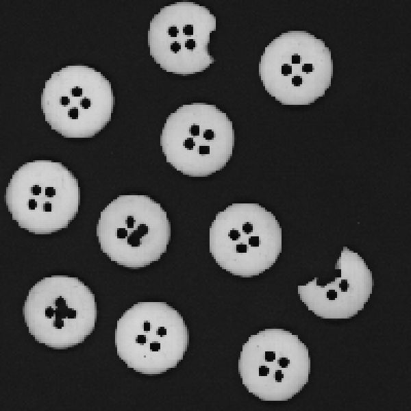
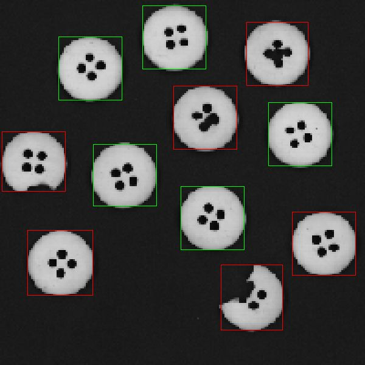

<h1>Damage Detect Program</h1>

This is the algorithm to detect possible damaged buttons based on the number of pixels the button consists of. The input is a .ppm img file from buttons factory and the output is an img file with all buttons identified. 

</img>
</img>
